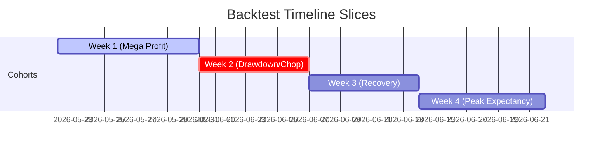

# 🏛️ Pure Quant Institutional Terminal: Aggregated Backtest Audit
**Date of Audit**: June 21, 2026  
**Audited Runs**: Run ID 19 (30D), Run ID 20 (21D), Run ID 21 (14D), Run ID 22 (7D)

---

## 📊 1. Multi-Run Executive Dashboard

This table summarizes the overall metrics across the four overlapping backtest windows.

| Metric | Run 19 (30-Day Window) | Run 20 (21-Day Window) | Run 21 (14-Day Window) | Run 22 (7-Day Window) |
| :--- | :--- | :--- | :--- | :--- |
| **Date Range** | May 22 to Jun 21 | May 31 to Jun 21 | Jun 07 to Jun 21 | Jun 14 to Jun 21 |
| **Total Trades** | 1,717 | 1,139 | 688 | 371 |
| **Win Rate** | 62.67% | 56.54% | 58.43% | **63.07%** |
| **Net Profit (R)** | +408.65 R | +157.91 R | +209.14 R | **+121.63 R** |
| **Max Drawdown (R)** | -86.38 R | -98.71 R | -82.29 R | **-30.66 R** |
| **Profit Factor** | 1.67 | 1.33 | 1.77 | **1.95** |
| **Expectancy (R/trade)**| +0.238 R | +0.139 R | +0.304 R | **+0.328 R** |
| **Recovery Factor** | 4.73x | 1.60x | 2.54x | **3.97x** |

---

## 📅 2. Isolated Weekly Cohort Analysis

To understand the exact timeline of profitability, we sliced the 30-day data (from Run 19) into four distinct, non-overlapping 7-to-9 day weekly cohorts.

### Weekly Performance Matrix

| Cohort | Date Range | Trades | Win Rate | Net Profit | Max Drawdown | Profit Factor | Expectancy |
| :--- | :--- | :--- | :--- | :--- | :--- | :--- | :--- |
| **Week 1** | May 22 – May 30 | 601 | **71.88%** | **+229.97 R** | **-26.19 R** | **2.51** | **+0.383 R** |
| **Week 2** | May 31 – Jun 06 | 428 | 56.54% | **-30.47 R** | -88.11 R | 0.84 | -0.071 R |
| **Week 3** | Jun 07 – Jun 13 | 310 | 54.19% | **+90.51 R** | -61.22 R | 1.64 | +0.292 R |
| **Week 4** | Jun 14 – Jun 21 | 378 | 61.90% | **+118.63 R** | -33.66 R | 1.91 | +0.314 R |

### 🔍 Cohort Diagnostics:
*   **Week 1 (Trend Acceleration)**: Exceptional performance. The system captured clean trend extensions in Yen pairs (`USDJPY`, `GBPJPY`) and Gold.
*   **Week 2 (System Drawdown)**: The primary risk event. The system experienced high whipsaw frequency during a market-wide regime shift. The profit factor fell below 1.0 (0.84), leading to a drawdown of **-30.47 R** (with an intra-week max drawdown spike of **-88.11 R**).
*   **Week 3 (High-R Recovery)**: Despite having the lowest win rate (54.19%), the net profit recovered sharply to **+90.51 R** with a solid Profit Factor of 1.64, indicating that the system's risk-reward ratio expanded to capture large recovery swings.
*   **Week 4 (Sustained Alpha)**: High win rate (61.90%) and expectancy (+0.314 R/trade) with low drawdown (-33.66 R). This week consolidated the recovery.

---

## 💱 3. Asset Rotation & Volume Drift

Tracking the asset-level returns across the 4 runs reveals a **regime rotation** from Yen crosses to USD major pairs:

| Symbol | Run 19 (30d) Net R | Run 20 (21d) Net R | Run 21 (14d) Net R | Run 22 (7d) Net R |
| :--- | :--- | :--- | :--- | :--- |
| **GC=F (Gold)** | +103.22 R | +54.95 R | +44.00 R | **+48.10 R** |
| **NZDUSD=X** | +51.12 R | +29.80 R | +42.76 R | **+44.87 R** |
| **EURUSD=X** | +14.75 R | +14.79 R | +26.48 R | **+26.49 R** |
| **AUDUSD=X** | +15.56 R | -1.15 R | +19.26 R | **+12.81 R** |
| **USDJPY=X** | +110.04 R | +45.87 R | +40.72 R | **+5.28 R** |
| **GBPUSD=X** | +19.27 R | -0.11 R | +37.61 R | **+4.70 R** |
| **CL=F (Crude)** | +0.50 R | +0.50 R | +0.50 R | **+0.50 R** |
| **GBPJPY=X** | +94.18 R | +13.27 R | -2.20 R | **-21.11 R** |

### Key Strategic Inferences:
1.  **GBPJPY Suspension Recommended**: GBPJPY yielded **-21.11 R** in the last 7 days and is in a persistent drawdown state. 
2.  **Gold & NZDUSD Dominance**: Gold (`GC=F`) and NZDUSD remain the core anchors of system performance, showing stable positive yield in all timeframes.
3.  **USD Majors Expansion**: EURUSD, AUDUSD, and GBPUSD experienced major expansions in profitability starting from Week 3, compensating for the decline in Yen pair volume/profitability.

---

## 🛠️ 4. Action Plan for Live Execution (`mt5_handler.py`)

1.  **De-risk GBPJPY**: Set GBPJPY risk parameters to `0%` or apply strict regime-based filters to avoid further drawdown.
2.  **Overweight Gold and NZDUSD**: Prioritize entries in `GC=F` and `NZDUSD=X` due to high win rate consistency.
3.  **Visual Audit**: Refer to `backtest_dashboard.html` for full graphical equity curves.
